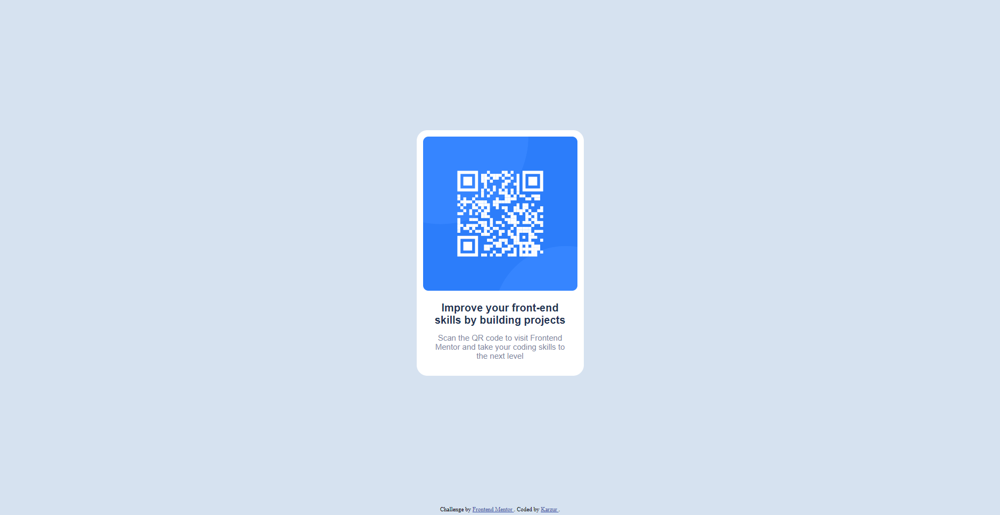

# Frontend Mentor - QR code component solution

This is a solution to the [QR code component challenge on Frontend Mentor](https://www.frontendmentor.io/challenges/qr-code-component-iux_sIO_H). Frontend Mentor challenges help you improve your coding skills by building realistic projects. 

## Table of contents

- [Overview](#overview)
  - [Screenshot](#screenshot)
  - [Links](#links)
- [My process](#my-process)
  - [Built with](#built-with)
  - [What I learned](#what-i-learned)
  - [Useful resources](#useful-resources)
- [Author](#author)

## Overview

### Screenshot

### Links

- [Live preview of website](https://qr-code-component-kohl-theta.vercel.app)

## My process

### Built with

- Mobile-first workflow
- Flexbox
- CSS Grid

### What I learned

1. How to properly position elements inside HTML file using CSS styles
2. Mobile-first workflow
3. Working on responsive website

### Useful resources

- [CSS unit description](https://www.w3.org/Style/Examples/007/units.pl.html/) - This helped me understand how different CSS units works. Helpful for responsive web design (website in polish).
- [A Complete Guide to Flexbox](https://css-tricks.com/snippets/css/a-guide-to-flexbox/) - All knowledge about Flexbox and how to use it.

## Author

- Frontend Mentor - [@Karzur](https://www.frontendmentor.io/profile/Karzur)